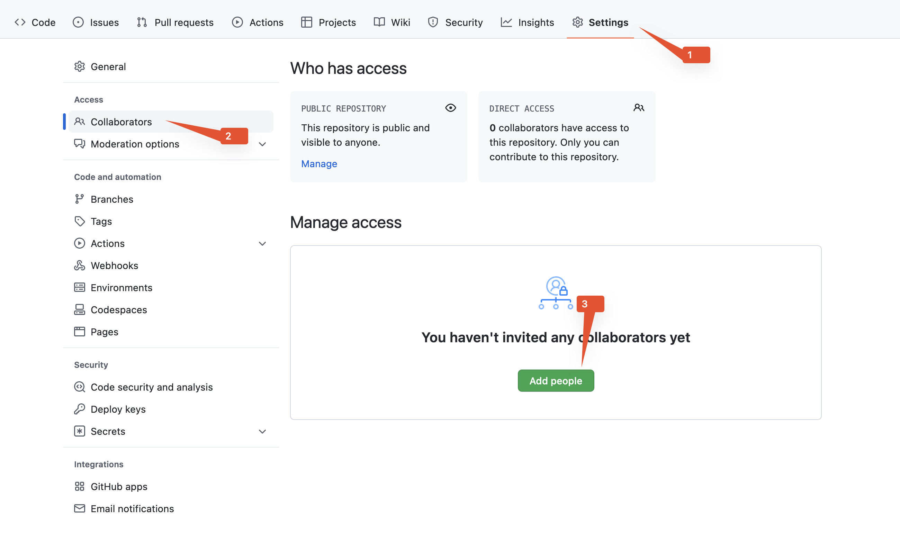

# Процесс сдачи финального задания

Для сдачи домашнего задания надо выполнить следующие действия (по порядку):

1. Создайте репозиторий на GitHub, для этого перейдите на главную [github.com](https://github.com/)
и нажмите на зелёную кнопку "New":

2. Обязательно выберите Initialize this repository with: Add a README file.
Остальные опции — по желанию:

3. Склонируйте себе ваш репозиторий (в примере он называется `aaa-final-task`):
```
git clone https://github.com/username/aaa-final-task.git
```
4. Создайте ветку с подходящим именем (например, my-final-task):
```
$ cd aaa-final-task
$ git switch -c my-final-task
```
5. Реализуйте домашнее задание
6. Проверьте, что линтеры (рекомендуется использовать как минимум flake8 и mypy) завершаются успешно:
```
$ cd aaa-final-task
$ flake8 .
$ mypy .
```
7. Зафиксируйте (commit) изменения и загрузите (push) ветку на github:
```
$ git commit -am "Do an AAA final task"
$ git push --set-upstream origin my-final-task
```
8. Перейдите на страницу вашего репозитория, в шапке появится сообщение с
предложением создать Pull Request из вновь созданной ветки.
Нажмите на зелёную кнопку "Compare & pull request".

9. Пройдите по ссылке, впишите описание: текст задания + особенности решения.
10. Просмотрите изменения, и, если всё корректно, нажмите кнопку "Create pull request".

11. Добавьте описание и наставников в репозиторий (об этом ниже).
12. Приложите ссылку на PR к вашему домашнему заданию на Stepik
13. Пройдите ревью и, после одобрения, вмержьте PR в master.
__Убедительная просьба не мержить без апрува от проверяющего!__


## Добавление преподавателей в репозиторий

Зайдите на страницу настроек доступа репозиторий (Settings -> Collaborators), нажмите "Add people" и пригласите преподавателей:


- Александр Непочатых — [anepochatykh](https://github.com/anepochatykh)
- Дима Куприянов — [kupro](https://github.com/kupro)
- Павел Лысак — [pulysak](https://github.com/pulysak)
- Сергей Нинуа — [ffix](https://github.com/ffix)
- Роман Афанаскин - [siauPatrick](https://github.com/siauPatrick)
- Нияз Хабибулин - [UnholyDk](https://github.com/UnholyDk)

# Как получить больше баллов?

Если преподаватель одобрил (approve) ваш PR, но вы хотите получить больше баллов за него
(например, вы получили 8 баллов из 10 при проходном 6), просто продолжайте пушить
изменения в ту же ветку. Эти изменения автоматически отразятся в вашем PR.


# Обратная связь
Это базовая инструкция по сдаче домашнего задания, если у вас есть пожелания, предложения,
фиксы ошибок или опечаток — можно исправить их через механизм PR.

